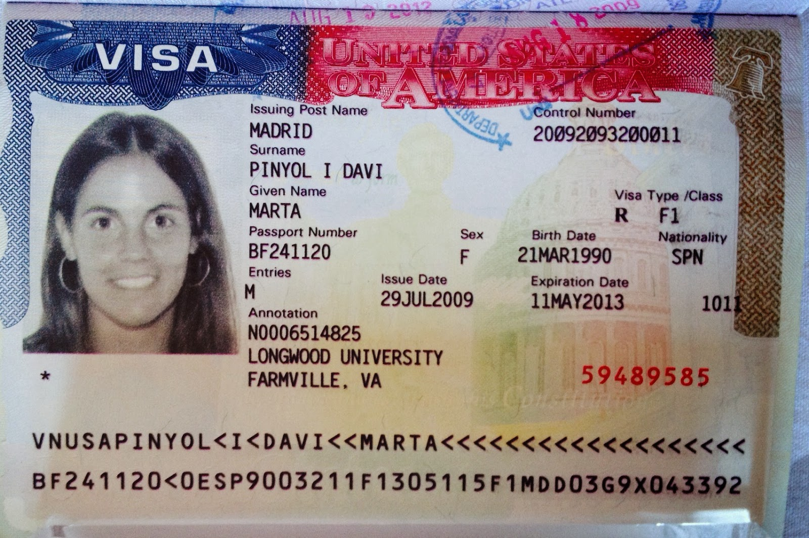
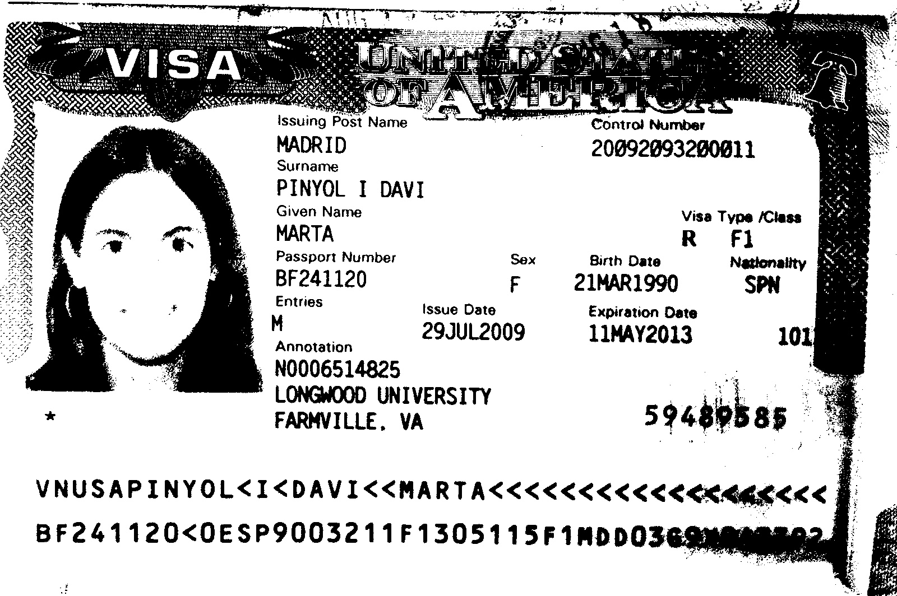
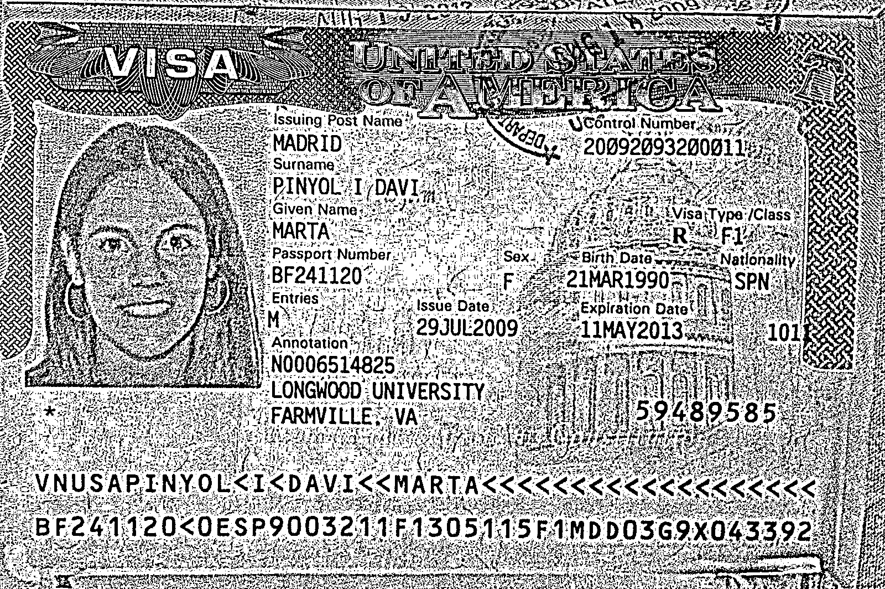
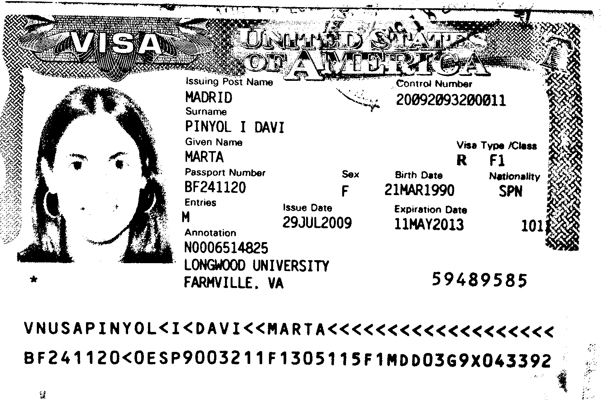
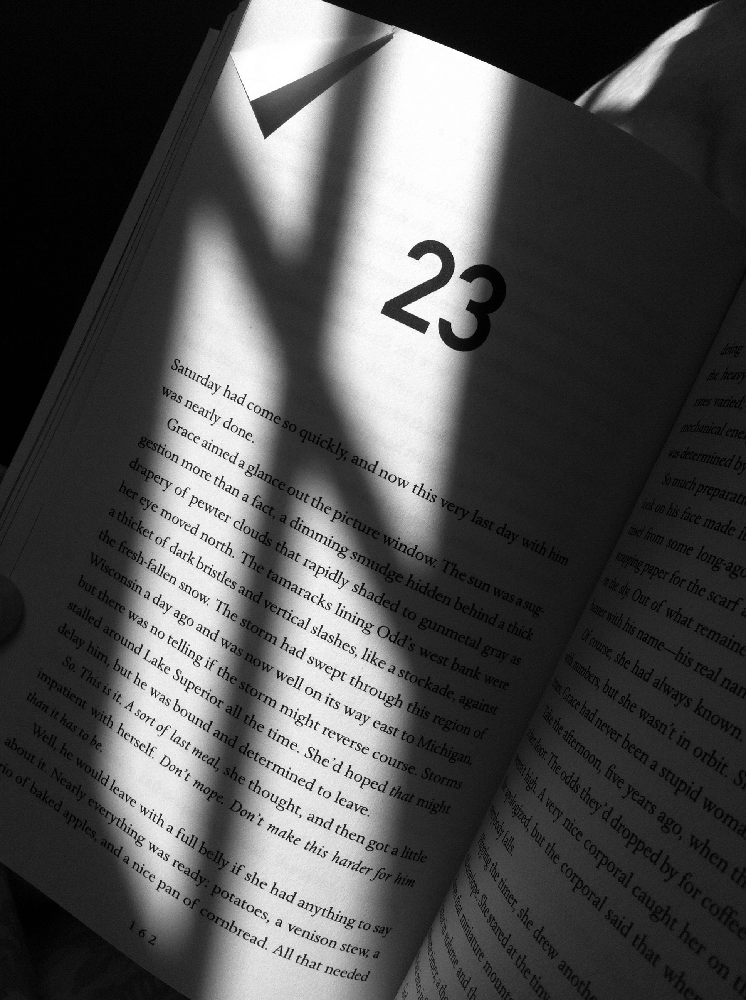
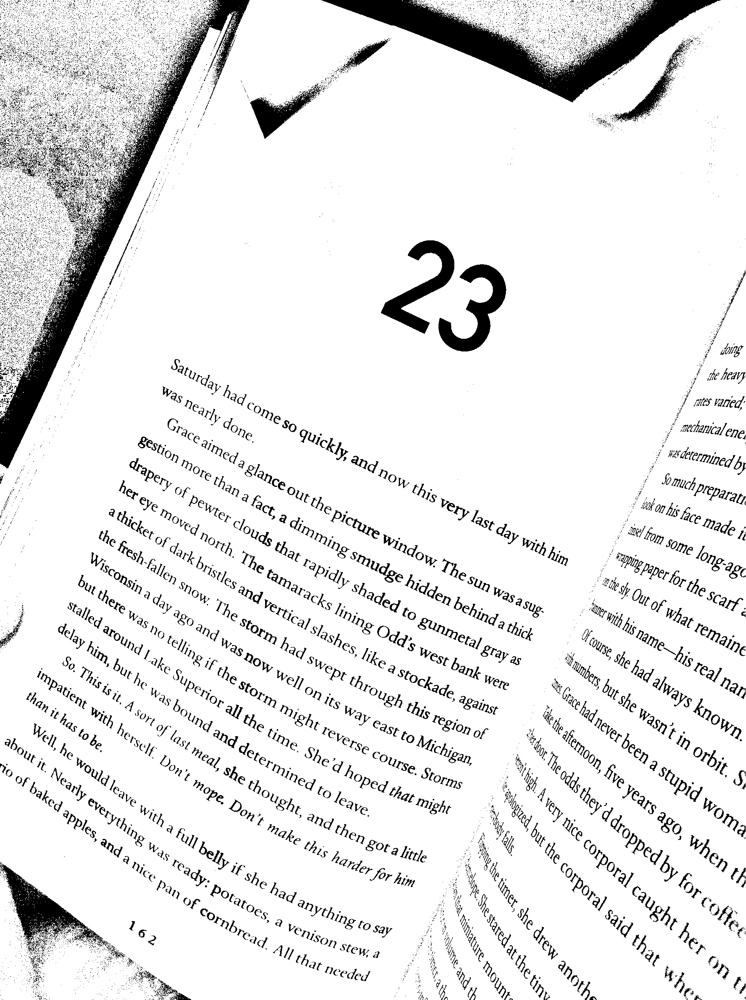

# Image adaptative thresholding for tesseract-OCR
This algorithm is based on [Adaptative Thresholding using the integral image](http://citeseerx.ist.psu.edu/viewdoc/download?doi=10.1.1.420.7883&rep=rep1&type=pdf)

The goal is to create a binary representation of the image, classifying each pixel into one of two categories, such as "black" or "white". This is a common task in many image processing applications, and some computer graphics applications. 

However, fixed thresholding often fails if the illumination varies spatially in the image or over time in a video stream. <br>In order to account for variations in illumination, the common solution is adaptive thresholding. The main difference here is that a different threshold value is computed for each pixel in the image.

Tesseract OCR internally applies [Otsu binarization method](https://ieeexplore.ieee.org/stamp/stamp.jsp?arnumber=4310076). However this method selects an optimal global threshold according to image histogram. If there is a shadow on the image, tesseract will fail extracting the characters.

|  Original Image  | Otsu thresholding |
| :-------------: | :----------: | 
|   |    | 
| **OpenCV Adaptative Thresholding**   |**This Repo Adaptative Thresholding** |
|    |  |

## Prerequisites
* [Python3](https://www.python.org/)
* [opencv-python](https://pypi.python.org/pypi/opencv-python)
* [numpy](https://scipy.org/install.html)

## How to use
Make sure python3 and pip is installed. Then, install cv2 and numpy.

```bash
#install opencv-python
pip install cv2
#install PyWavelets
pip install numpy
```

Let's binarize the upper post image using the script. Type on shell in project directory:

```bash
python adaptativeThreshold.py -i images/visausa.jpg
```
The script saves the black and white image as "visausa_bin.jpg" in the current directory.

If you need help using the script type on bash in current directory:

```bash
python adaptativeThreshold.py -h
```
Getting as output:

```bash
usage: adaptativeThreshold.py [-h] -i INPUT_PATH [-t THRESHOLD]

applies adaptative binarization and saves output.

optional arguments:
  -h, --help            show this help message and exit
  -i INPUT_PATH, --input_path INPUT_PATH
                        image path
  -t THRESHOLD, --threshold THRESHOLD
                        binarization threshold
```
 

## Configuring the threshold

You might need to configure the threshold depending on the image size and background color.
For example the following image (1936 × 2592):

<p align="center">
  
</p>

His optimal threshold due to high resolution is 50. Let's binarize the image using 50 as threshold. Type on bash in project directory:

```bash
python adaptativeThreshold.py -i images/hh.jpg -t 50
```
Getting the output image hh_bin.jpg on current directory.

<p align="center">
  
</p>

## Acknowlegements

[1] Bradley, D., G. Roth, "Adapting Thresholding Using the Integral Image," Journal of Graphics Tools. Vol. 12, No. 2, 2007, pp.13-21.

[2] Otsu, N., "A Threshold Selection Method from Gray-Level Histograms," IEEE Transactions on Systems, Man, and Cybernetics, Vol. 9, No. 1, 1979, pp. 62-66.

[3] WELLNER, P. D. 1993. Adaptive thresholding for the digitaldesk. Tech. Rep. EPC-93-110, EuroPARC.


